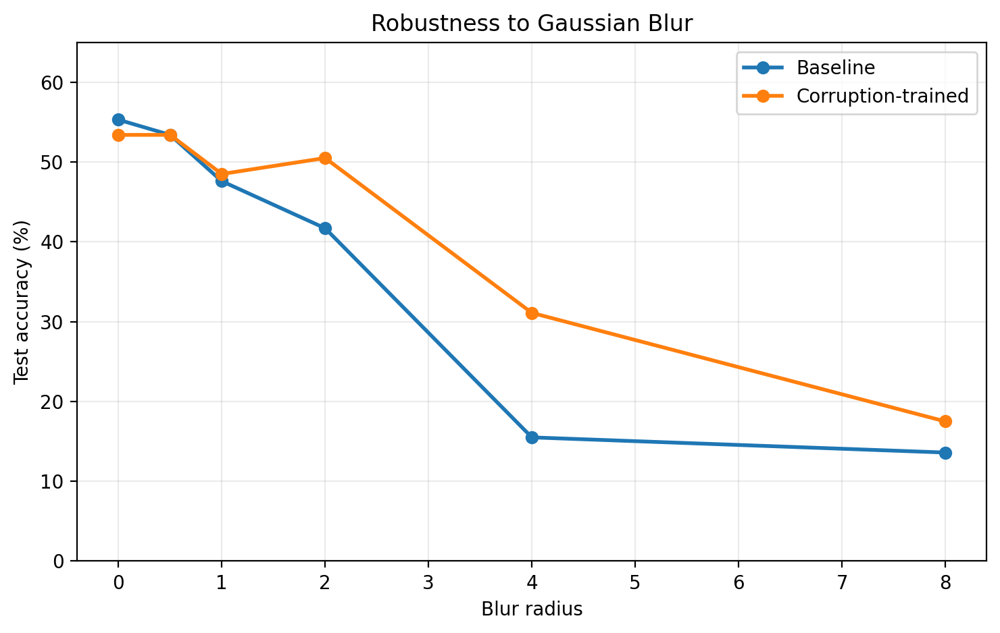
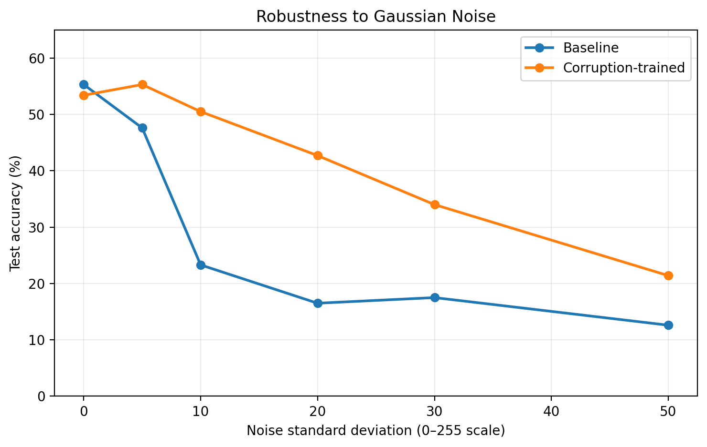
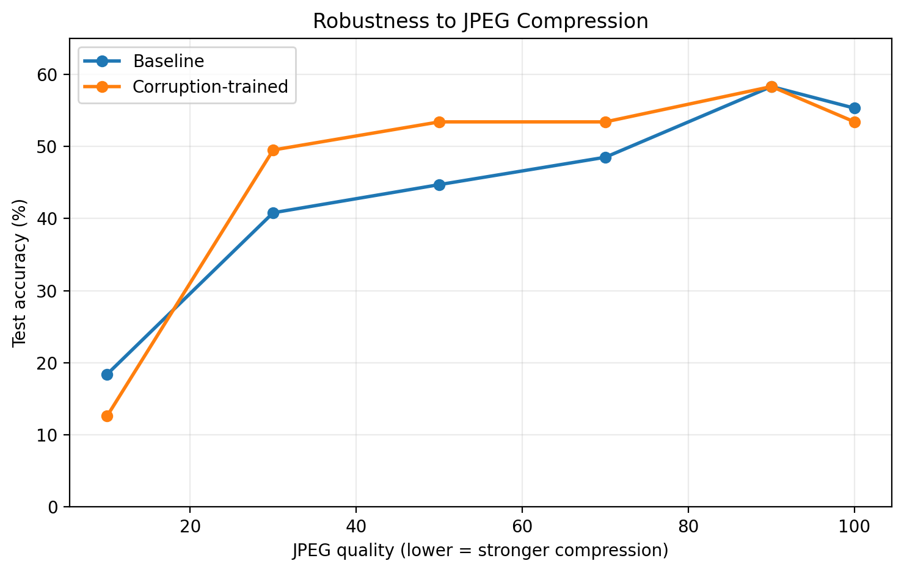

# Retinal Image Robustness

A study of how image degradation affects diabetic-retinopathy classification and whether corruption-aware training can improve robustness.

## Overview

Deep-learning models for medical imaging are usually evaluated on clean test data, but real images may be affected by blur, sensor noise, illumination changes, contrast shifts, or image compression.

This project studies how these corruptions affect a retinal-image classifier trained on the IDRiD diabetic-retinopathy dataset.

I trained two ImageNet-pretrained ResNet-18 models:

1. a **baseline model** using ordinary image augmentation;
2. a **corruption-trained model** exposed during training to additional synthetic degradations.

Both models use the same architecture, image size, batch size, training/validation split, optimizer, and evaluation pipeline. The main experimental difference is the corruption-aware augmentation used by the robust model.

The final experiment evaluates both fixed models on exactly the same corrupted versions of the official IDRiD test images.

---

## Dataset

The project uses the **IDRiD disease-grading dataset**.

The original training set contains 413 retinal fundus images across five diabetic-retinopathy severity grades:

| Grade | Images |
|---|---:|
| 0 | 134 |
| 1 | 20 |
| 2 | 136 |
| 3 | 74 |
| 4 | 49 |

The dataset is strongly imbalanced, particularly for grade 1.

The official training data is divided into a stratified training and validation split, while the official IDRiD test set is reserved for final evaluation.

---

## Model

Both classifiers use an ImageNet-pretrained **ResNet-18**.

The original 1000-class ImageNet output layer is replaced with a five-class classifier for diabetic-retinopathy severity.

### Shared configuration

- Architecture: ResNet-18
- Input size: **384 × 384**
- Batch size: **8**
- Optimizer: AdamW
- Learning rate: `1e-4`
- Loss: cross-entropy
- Epochs: 15
- Model selection: best validation accuracy

Before entering the network, retinal images are cropped to remove much of the black background and are normalized using ImageNet channel statistics.

---

## Baseline Model

The baseline training pipeline uses mild augmentation:

- horizontal flips
- small rotations
- small brightness changes
- small contrast changes
- small saturation changes

The selected baseline model achieved:

**55.3% clean test accuracy**

---

## Corruption-Aware Model

The second model uses the same basic pipeline but receives additional randomized corruptions during training, including:

- Gaussian blur
- Gaussian noise
- JPEG compression
- stronger appearance variation

The purpose is to encourage the network to learn features that remain useful when image quality degrades.

Its clean test accuracy was:

**53.4%**

This is only **1.9 percentage points lower** than the baseline.

---

# Robustness Results

## Gaussian Blur



| Blur Radius | Baseline | Robust | Change |
|---:|---:|---:|---:|
| 0 | 55.3% | 53.4% | -1.9 |
| 0.5 | 53.4% | 53.4% | 0.0 |
| 1 | 47.6% | 48.5% | +1.0 |
| 2 | 41.7% | 50.5% | +8.7 |
| 4 | 15.5% | 31.1% | **+15.5** |
| 8 | 13.6% | 17.5% | +3.9 |

The baseline model becomes highly sensitive to stronger blur.

At blur radius 4, corruption-aware training improves accuracy from **15.5% to 31.1%**.

---

## Gaussian Noise



| Noise Std. | Baseline | Robust | Change |
|---:|---:|---:|---:|
| 0 | 55.3% | 53.4% | -1.9 |
| 5 | 47.6% | 55.3% | +7.8 |
| 10 | 23.3% | 50.5% | **+27.2** |
| 20 | 16.5% | 42.7% | **+26.2** |
| 30 | 17.5% | 34.0% | +16.5 |
| 50 | 12.6% | 21.4% | +8.7 |

Gaussian noise produced the strongest robustness gains.

At noise standard deviation 10, the robust model improves from **23.3% to 50.5%**.

At standard deviation 20, accuracy improves from **16.5% to 42.7%**.

---

## JPEG Compression



| JPEG Quality | Baseline | Robust | Change |
|---:|---:|---:|---:|
| 100 | 55.3% | 53.4% | -1.9 |
| 90 | 58.3% | 58.3% | 0.0 |
| 70 | 48.5% | 53.4% | +4.9 |
| 50 | 44.7% | 53.4% | +8.7 |
| 30 | 40.8% | 49.5% | +8.7 |
| 10 | 18.4% | 12.6% | -5.8 |

The corruption-trained model improves robustness to moderate and heavy JPEG compression, although extremely severe compression remains difficult.

---

## Brightness

| Brightness Factor | Baseline | Robust | Change |
|---:|---:|---:|---:|
| 0.25 | 38.8% | 54.4% | **+15.5** |
| 0.50 | 54.4% | 55.3% | +1.0 |
| 0.75 | 57.3% | 56.3% | -1.0 |
| 1.00 | 55.3% | 53.4% | -1.9 |
| 1.25 | 55.3% | 56.3% | +1.0 |
| 1.50 | 53.4% | 51.5% | -1.9 |
| 1.75 | 47.6% | 48.5% | +1.0 |

The largest brightness improvement occurs for very dark images.

---

## Contrast

| Contrast Factor | Baseline | Robust | Change |
|---:|---:|---:|---:|
| 0.25 | 43.7% | 58.3% | **+14.6** |
| 0.50 | 53.4% | 54.4% | +1.0 |
| 0.75 | 54.4% | 57.3% | +2.9 |
| 1.00 | 55.3% | 53.4% | -1.9 |
| 1.25 | 54.4% | 53.4% | -1.0 |
| 1.50 | 57.3% | 49.5% | -7.8 |
| 2.00 | 53.4% | 43.7% | -9.7 |

The robust model improves performance under low contrast but performs worse under unusually high contrast.

---

# Key Findings

Corruption-aware training produced a favorable but non-universal robustness tradeoff.

Clean accuracy changed only slightly:

**55.3% → 53.4% (-1.9 points)**

while several degraded conditions improved substantially:

| Condition | Baseline | Robust | Improvement |
|---|---:|---:|---:|
| Noise std 10 | 23.3% | 50.5% | **+27.2** |
| Noise std 20 | 16.5% | 42.7% | **+26.2** |
| Blur radius 4 | 15.5% | 31.1% | **+15.5** |
| Brightness 0.25 | 38.8% | 54.4% | **+15.5** |
| Contrast 0.25 | 43.7% | 58.3% | **+14.6** |
| JPEG quality 30 | 40.8% | 49.5% | **+8.7** |

The strongest gains occurred under Gaussian noise.

The experiment also shows that robustness training is not universally beneficial. High-contrast images and extremely compressed JPEG images sometimes performed worse.

---

## Project Structure

```text
retina-robustness/
├── dataset.py
├── train_robust.py
├── robustness.py
├── results.txt
├── figures/
│   ├── gaussian_blur_robustness.png
│   ├── gaussian_noise_robustness.png
│   └── jpeg_compression_robustness.png
└── README.md
```

- `dataset.py` trains the baseline classifier and saves `best_model.pth`.
- `train_robust.py` trains the corruption-aware classifier and saves `best_robust_model.pth`.
- `robustness.py` loads both fixed models and evaluates them under identical corruption conditions.
- `results.txt` stores the final numerical results.
- `figures/` contains visualizations of the major robustness experiments.

The IDRiD image data and trained model checkpoints are excluded from version control.

---

## Limitations

This project is an exploratory robustness study, not a clinically validated diagnostic system.

Important limitations include:

- only 413 original training images;
- strong class imbalance;
- only 20 grade-1 examples;
- poor performance on grade 1;
- a relatively small official test set;
- one model architecture;
- synthetic corruptions rather than naturally collected degraded medical images;
- corruption-specific robustness gains that do not necessarily transfer to every distribution shift.

---

## Conclusion

The baseline ResNet-18 classifier was highly sensitive to several kinds of image degradation, especially Gaussian noise and strong blur.

Corruption-aware training preserved most clean-image performance while substantially improving robustness under several severe corruptions.

The largest improvement occurred under Gaussian noise, where accuracy increased by **27.2 percentage points** at noise standard deviation 10.

These results demonstrate that clean test accuracy alone can hide important failure modes and that robustness-oriented training can substantially reduce some of those failures without necessarily improving every operating condition.